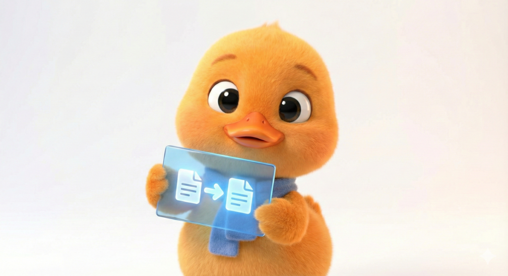
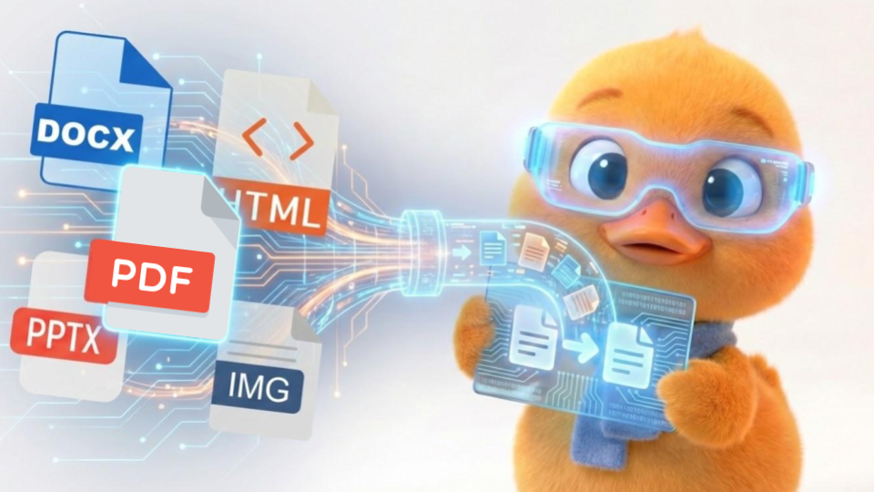
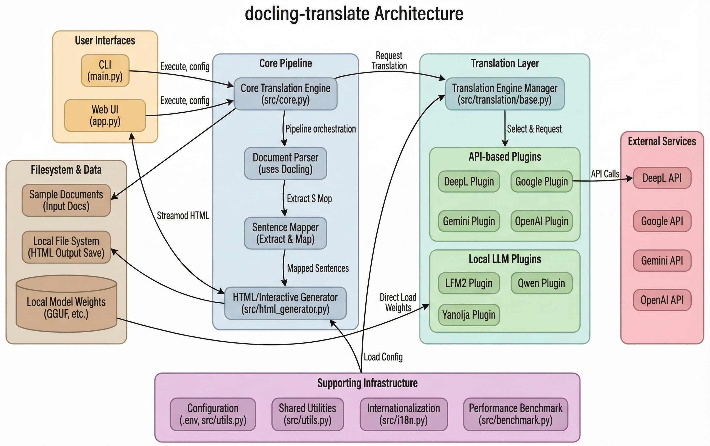

# docling-translate

<!-- <p align="center">
  
</p> -->

> **Docling 기반의 구조 보존형 문서 번역 도구**  
> PDF, DOCX, PPTX, HTML, 이미지, **코드 파일 및 텍스트 파일**의 구조를 유지하며 인터랙티브 비교 뷰를 제공합니다.

[](https://github.com/gyunggyung/docling-translate/stargazers)
[](https://docling-translate.readthedocs.io/ko/latest/?badge=latest)
[](LICENSE)
[](requirements.txt)
[](docs/README.en.md)
[](https://github.com/gyunggyung/docling-translate/discussions)

## 개요

`docling-translate`는 IBM의 [docling](https://github.com/ds4sd/docling) 라이브러리를 활용하여 문서의 복잡한 구조(표, 이미지, 다단 레이아웃)를 분석하고, 원문과 번역문을 **문장 단위로 매핑(1:1 Mapping)** 하여 제공하는 오픈소스 도구입니다.

<p align="center">
  
</p>

기계 번역의 고질적인 문제인 **불완전한 문맥 전달과 오역**을 보완하기 위해 설계되었습니다. 단순한 텍스트 치환을 넘어, **Side-by-Side(좌우 대조)** 및 **Interactive(클릭 시 원문 확인)** 뷰를 제공하여 사용자가 원문을 즉시 확인하고 내용을 완벽하게 이해할 수 있도록 돕습니다.

## 데모

<p align="center">
  
</p>

## 주요 기능

- **다양한 포맷 지원**: `PDF`, `DOCX`, `PPTX`, `HTML`, `Image`, **텍스트/코드 파일**을 **인터랙티브 뷰어(HTML)** 형태로 변환 및 번역.
- **문장 단위 병렬 번역**: 원문 한 문장, 번역문 한 문장을 정확히 매칭하여 가독성 극대화.
- **레이아웃 보존**: 문서 내의 표(Table)와 이미지(Image)를 유지하며 번역.
- **스마트 코드 번역**: 코드 파일(.py, .js, .ts, .java, .c, .go 등)의 **주석과 독스트링만 번역**하고 코드 구조는 그대로 유지.
- **마크다운 렌더링**: 마크다운 파일은 제목, 리스트, 코드 블록 등이 제대로 렌더링된 HTML로 변환.
- **유연한 엔진 선택**: Google Translate, DeepL, Gemini, OpenAI GPT-5-nano, Qwen(Local), LFM2(Local), LFM2-KOEN-MT(Local), NLLB-200(Local), NLLB-KOEN(Local), Yanolja(Local) 지원.
- **고성능 처리**: 멀티스레딩(`max_workers`)을 통한 대량 문서 고속 병렬 처리.
- **Fast Mode 지원**: `pypdfium2` 백엔드 가속을 통해 **3-5배 빠른** PDF 파싱 지원 (`--fast` 옵션).

## 빠른 시작

### 1. 설치

Python 3.10 이상 환경이 필요합니다.

```bash
git clone https://github.com/gyunggyung/docling-translate.git
cd docling-translate
pip install -r requirements.txt
```

### Docker로 실행 (권장)

Docker만 설치되어 있으면 별도 Python 환경 없이 바로 실행할 수 있습니다.

```bash
# 이미지 빌드
docker build -t docmindai .

# Web UI 실행 (http://localhost:8501)
docker run --rm -p 8501:8501 --env-file .env docmindai
```

`.env` 파일이 없다면 `--env-file .env` 옵션을 제거해도 됩니다. (DeepL/Gemini/OpenAI 엔진 미사용 시)

**(선택) 로컬 번역 모델(Qwen, LFM2, Yanolja) 사용 시**
Qwen, LFM2 등 로컬 LLM을 사용하려면 `llama-cpp-python`과 `huggingface_hub`를 추가로 설치해야 합니다.
- **Windows 사용자**: [Visual Studio Build Tools](https://visualstudio.microsoft.com/visual-cpp-build-tools/) 설치 ("C++를 사용한 데스크톱 개발" 체크) 후:
  ```bash
  pip install llama-cpp-python huggingface_hub
  ```
- **Mac/Linux 사용자**:
  ```bash
  pip install llama-cpp-python huggingface_hub
  ```

**(선택) CPU 성능 최적화 (AVX2 빌드) - 2~3배 속도 향상**
기본 설치 대신 AVX2 명령어를 활성화하여 빌드하면 CPU 번역 속도가 2~3배 빨라집니다.
```powershell
# Windows (PowerShell)
pip uninstall llama-cpp-python -y
$env:CMAKE_ARGS = "-DGGML_AVX2=on"
pip install llama-cpp-python --force-reinstall --no-cache-dir
```
```bash
# Linux/Mac
pip uninstall llama-cpp-python -y
CMAKE_ARGS="-DGGML_AVX2=on" pip install llama-cpp-python --force-reinstall --no-cache-dir
```

**(선택) NLLB 번역 모델(nllb, nllb-koen) 사용 시**
```bash
pip install ctranslate2 transformers sentencepiece hf_xet
```

### 2. CLI 실행

가장 기본적인 사용법입니다. PDF 파일을 지정하면 **인터랙티브 HTML 파일**이 생성됩니다.

```bash
# 기본 번역 (영어 -> 한국어)
python main.py sample.pdf

# Fast Mode 사용 (3-5배 빠른 속도, 레이아웃 단순화)
python main.py sample.pdf --fast

# 옵션 사용 (DeepL 엔진, 일본어 번역)
python main.py sample.pdf --engine deepl --target ja

# OpenAI GPT-5-nano 사용
python main.py sample.pdf --engine openai --target ko

# LFM2 로컬 모델 사용
python main.py sample.pdf --engine lfm2 --target ko

# LFM2-KOEN-MT 모델 사용 (한국어-영어 전용, 고품질)
python main.py sample.pdf --engine lfm2-koen-mt --target ko

# NLLB-200 모델 사용 (200개 언어 지원)
python main.py sample.pdf --engine nllb --target ko

# NLLB-KOEN 모델 사용 (한국어-영어 Fine-tuned, BLEU 33.66)
python main.py sample.pdf --engine nllb-koen --target ko

# 마크다운 파일 번역 (HTML로 렌더링)
python main.py README.md --source en --target ko

# Python 파일 번역 (주석/독스트링만 번역)
python main.py script.py --source ko --target en

# 텍스트 파일 번역
python main.py notes.txt --source en --target ko
```

### API 키 설정 (선택 사항)

DeepL, Gemini, OpenAI를 사용하려면 `.env` 파일에 API 키를 설정해야 합니다.

```bash
# .env.example을 .env로 복사
cp .env.example .env

# .env 파일 편집에 API 키 입력
OPENAI_API_KEY=sk-proj-your-api-key-here
DEEPL_API_KEY=your-deepl-key-here
GEMINI_API_KEY=your-gemini-key-here
```

**API 키 발급 링크**:
- [OpenAI API Keys](https://platform.openai.com/api-keys) - GPT-5-nano 사용 (입력 $0.05/1M, 출력 $0.40/1M 토큰)
- [DeepL API](https://www.deepl.com/pro-api)
- [Google AI Studio](https://aistudio.google.com/app/apikey) - Gemini 사용

### 3. Web UI 실행

직관적인 웹 인터페이스를 통해 파일을 업로드하고 결과를 시각적으로 확인할 수 있습니다.

```bash
streamlit run app.py
```

### Web UI 주요 기능

- **집중 모드**: 사이드바와 컨트롤을 숨겨 번역 결과에만 집중할 수 있습니다.
- **뷰 모드 제어**: 원문-번역문 대조 보기(Inspection Mode)와 번역문만 보기(Reading Mode)를 전환할 수 있습니다.
- **실시간 진행률 표시**: 문서 변환, 텍스트 추출, 번역, 이미지 저장 등 각 단계별 상세 상태와 진행률을 실시간으로 확인할 수 있습니다.
- **번역 기록 관리**: 이전 번역 결과를 자동으로 저장하고 불러올 수 있습니다.

## 텍스트 및 코드 파일 번역

문서 외에도 다양한 텍스트 기반 파일의 **스마트 번역**을 지원합니다:

### 지원 파일 형식

| 카테고리 | 확장자 | 번역 방식 |
|----------|------------|---------------------|
| **마크다운** | `.md`, `.markdown` | 전체 번역, HTML로 렌더링 |
| **코드 파일** | `.py`, `.js`, `.ts`, `.java`, `.c`, `.cpp`, `.go`, `.rs` 등 | **주석/독스트링만** - 코드 구조 유지 |
| **설정 파일** | `.json`, `.yaml`, `.toml`, `.xml` | 전체 번역 |
| **일반 텍스트** | `.txt`, `.log` | 문단 단위 번역 |
| **확장자 없음** | `LICENSE`, `README` 등 | 텍스트로 감지, 문단 단위 번역 |

### 코드 파일 기능

- **원본 코드 구조 유지** + 줄 번호 표시
- **번역/원문 토글** 버튼으로 한 번에 전환
- **마우스 호버** 시 원문 툴팁 표시
- **다크/라이트 테마** 지원

## 아키텍처

<p align="center">
  
</p>

## 상세 가이드

더 자세한 사용법과 설정 방법은 아래 문서를 참고하세요.

- [📖 **상세 사용 가이드 (USAGE.md)**](docs/USAGE.md): CLI 전체 옵션, API 키 설정, 포맷별 특징.
- [🛠 **기여 가이드 (CONTRIBUTING.md)**](docs/CONTRIBUTING.md): 프로젝트 구조, 개발 워크플로우, 테스트 방법.
- [🤝 **지원 가이드 (SUPPORT.md)**](SUPPORT.md): 커뮤니티 참여 및 질문 방법.

## 프로젝트 웹사이트

<p align="center">
  
</p>

<!-- <p align="center">
  <a href="https://gyunggyung.github.io/docling-translate/">https://gyunggyung.github.io/docling-translate/</a>
</p> -->

## Acknowledgments

이 프로젝트는 [Docling](https://github.com/docling-project/docling) 라이브러리를 기반으로 합니다. 또한, 로컬 번역 기능을 위해 [Qwen](https://huggingface.co/Qwen/Qwen3-0.6B-GGUF), [LFM2](https://huggingface.co/LiquidAI/LFM2-1.2B-GGUF), [LFM2-KOEN-MT](https://huggingface.co/gyung/lfm2-1.2b-koen-mt-v8-rl-10k-merged-GGUF) (한국어-영어 전용), [NLLB-200](https://huggingface.co/facebook/nllb-200-distilled-600M) (200개 언어), [Yanolja](https://huggingface.co/yanolja/YanoljaNEXT-Rosetta-4B-2511-GGUF)의 오픈소스 모델을 활용합니다.

```bibtex
@techreport{Docling,
  author = {Deep Search Team},
  title = {Docling Technical Report},
  url = {https://arxiv.org/abs/2408.09869},
  year = {2024}
}

@misc{qwen3,
  title  = {Qwen3},
  url    = {https://qwenlm.github.io/blog/qwen3/},
  author = {Qwen Team},
  month  = {April},
  year   = {2025}
}

@misc{yanolja2025yanoljanextrosetta,
  author = {Yanolja NEXT Co., Ltd.},
  title = {YanoljaNEXT-Rosetta-4B-2511},
  year = {2025},
  publisher = {Hugging Face},
  journal = {Hugging Face repository},
  howpublished = {\\url{https://huggingface.co/yanolja/YanoljaNEXT-Rosetta-4B-2511}}
}

@article{liquidai2025lfm2technicalreport,
  title={LFM2 Technical Report}, 
  author={Liquid AI},
  year={2025},
  eprint={2511.23404},
  archivePrefix={arXiv},
  primaryClass={cs.LG},
  url={https://arxiv.org/abs/2511.23404}, 
}

@article{nllb2022,
  title={No Language Left Behind: Scaling Human-Centered Machine Translation},
  author={NLLB Team et al.},
  journal={arXiv preprint arXiv:2207.04672},
  year={2022},
  url={https://arxiv.org/abs/2207.04672}
}

@misc{nllb-finetuned-en2ko,
  author = {Jisu Kim, Juhwan Lee, TakSung Heo, Minsu Jeong},
  title = {NLLB Fine-tuned English to Korean},
  year = {2024},
  publisher = {Hugging Face},
  howpublished = {\\url{https://huggingface.co/NHNDQ/nllb-finetuned-en2ko}}
}

@misc{lfm2-koen-mt,
  author = {gyung},
  title = {LFM2-1.2B-KOEN-MT: Korean-English Translation Model},
  year = {2025},
  publisher = {Hugging Face},
  howpublished = {\\url{https://huggingface.co/gyung/lfm2-1.2b-koen-mt-v8-rl-10k-merged-GGUF}}
}

```

## 라이선스

이 프로젝트는 [Apache License 2.0](LICENSE)을 따릅니다.
